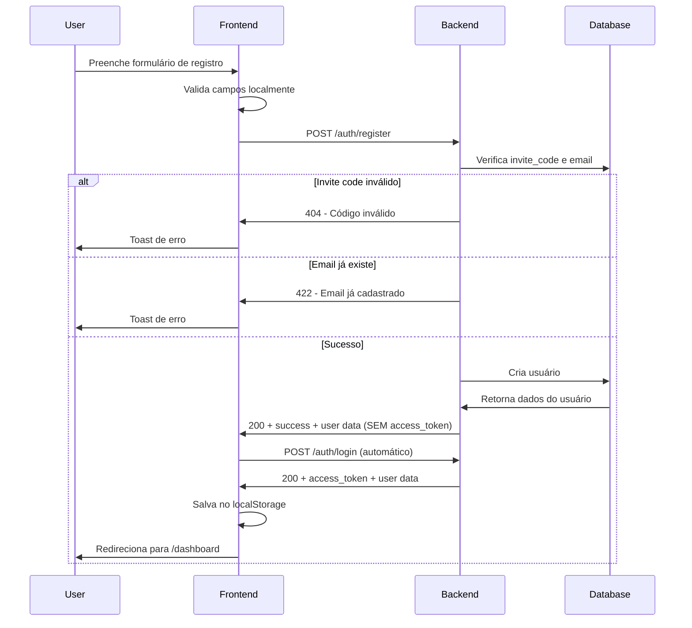

# Documentação da API - Contrato Frontend ↔ Backend

## Base URL
```
https://simas-webpage-485911123531.southamerica-east1.run.app
```

## Headers Padrão

Todas as requisições devem incluir:

```json
{
  "Content-Type": "application/json",
  "ngrok-skip-browser-warning": "true"
}
```

Requisições autenticadas adicionam:
```json
{
  "Authorization": "Bearer <access_token>"
}
```

---

## 1. AUTENTICAÇÃO

### 1.1. POST /auth/register – Criar conta (sem login automático)

#### ⚠️ IMPORTANTE
Este endpoint **NÃO retorna `access_token`**. Apenas cria o usuário.

#### Request Body
```json
{
  "nome": "João da Silva",
  "email": "joao@example.com",
  "password": "senha123",
  "invite_code": "ABC123"
}
```

**Validações:**
- `invite_code` (não `codigo_convite`) - comparado case-insensitive com `clientes.codigo_convite`
- `password` - mínimo 6 caracteres
- Cliente deve estar com `status = "ativo"`

#### Response de Sucesso (200 OK)
```json
{
  "success": true,
  "user": {
    "id": "uuid-do-usuario",
    "email": "joao@example.com",
    "nome": "João da Silva",
    "id_cliente": 123
  }
}
```

#### Responses de Erro

**404 Not Found** - Código de convite inválido ou inativo:
```json
{
  "detail": "Código de convite não encontrado ou inativo."
}
```

**422 Unprocessable Entity** - Validação Pydantic:
```json
{
  "detail": [
    {
      "type": "missing",
      "loc": ["body", "invite_code"],
      "msg": "Field required",
      "input": {
        "nome": "...",
        "email": "...",
        "password": "..."
      }
    }
  ]
}
```

**500 Internal Server Error** - Falha ao criar usuário/profile

#### Como o Frontend Deve Se Comportar

1. `/auth/register` apenas **cria a conta**
2. **NÃO** retorna `access_token`
3. Após sucesso (`success: true`), o frontend deve:
   - **Opção A:** Redirecionar para tela de login
   - **Opção B:** Chamar automaticamente `/auth/login` com mesmo email/password

⚠️ **Não tente ler `access_token` da resposta de `/auth/register`**

---

### 1.2. POST /auth/login – Login

#### Request Body
```json
{
  "email": "joao@example.com",
  "password": "senha123"
}
```

#### Response de Sucesso (200 OK)
```json
{
  "success": true,
  "access_token": "jwt-do-supabase",
  "refresh_token": "refresh-token",
  "expires_in": 3600,
  "user": {
    "id": "uuid-do-usuario",
    "email": "joao@example.com",
    "nome": "João da Silva",
    "id_cliente": 123
  }
}
```

#### Responses de Erro

**401 Unauthorized** - Credenciais inválidas:
```json
{
  "detail": "Credenciais inválidas"
}
```

**403 Forbidden** - Usuário sem empresa:
```json
{
  "detail": "Usuário sem empresa"
}
```

**422** - Validação (email inválido, senha curta, etc.)

#### Como o Frontend Deve Usar

1. Salvar `access_token`, `refresh_token`, `expires_in` e dados do usuário
2. Em todas as requisições autenticadas, enviar:
   ```
   Authorization: Bearer <access_token>
   ```

---

### 1.3. POST /auth/forgot_password

#### Request Body
```json
{
  "email": "joao@example.com"
}
```

#### Response de Sucesso
```json
{
  "success": true,
  "message": "Email enviado"
}
```

---

## 2. DASHBOARD

### GET /dashboard

**Autenticado** - Requer `Authorization: Bearer <access_token>`

#### Query Parameters

| Parâmetro | Tipo | Descrição | Exemplo |
|-----------|------|-----------|---------|
| `start` | string | Data início (YYYY-MM-DD) | `2025-11-01` |
| `end` | string | Data fim (YYYY-MM-DD) | `2025-11-30` |
| `status` | string | Filtro: `"enviada"`, `"pendente"`, `"erro"` | `pendente` |
| `nome` | string | Filtro por nome do periciado (contains) | `Maria` |
| `page` | number | Número da página (default: 1) | `1` |
| `page_size` | number | Itens por página (default: 50, máx: 200) | `50` |

#### Exemplo de Request
```bash
GET /dashboard?start=2025-11-01&end=2025-11-30&status=pendente&page=1&page_size=50
Authorization: Bearer <access_token>
```

#### Response de Sucesso (200 OK)
```json
{
  "summary_global": {
    "total_pericias": 120,
    "total_enviadas": 80,
    "total_com_erro": 10,
    "total_aguardando": 30,
    "total_atrasadas": 5,
    "total_uploads": 115
  },
  "summary_by_client": [
    {
      "id_cliente": 123,
      "cliente": "Fulano Advogados",
      "nome_empresa": "Fulano & Cia",
      "total_pericias": 120,
      "total_enviadas": 80,
      "total_com_erro": 10
    }
  ],
  "pericias_by_client": {
    "clients": [
      {
        "id_cliente": 123,
        "cliente": "Fulano Advogados",
        "nome_empresa": "Fulano & Cia",
        "pericias": [
          {
            "id_pericia": 1,
            "periciado": "Maria da Silva",
            "numero": "85999999999",
            "data": "2025-11-20",
            "horario": "13:40:00",
            "status": "pendente",
            "cpf": "00000000000",
            "endereco": "Rua X, 123...",
            "fileurl": null,
            "enviado": false,
            "erro": null
          }
        ]
      }
    ],
    "pagination": {
      "total": 120,
      "page": 1,
      "page_size": 50,
      "total_pages": 3
    }
  }
}
```

#### Status da Perícia

O campo `status` retorna:
- `"enviada"` - Perícia enviada com sucesso
- `"pendente"` - Aguardando envio
- `"erro"` - Erro ao enviar

#### Responses de Erro

**401** - Token ausente ou inválido:
```json
{
  "detail": "Token ausente"
}
// ou
{
  "detail": "Token inválido"
}
```

**403** - Usuário sem cliente vinculado:
```json
{
  "detail": "Usuário sem cliente vinculado"
}
```

---

## 3. PERÍCIAS

Todos os endpoints são **autenticados** (`Authorization: Bearer <access_token>`).

### 3.1. PATCH /pericias/{id_pericia} – Edição

#### Request Body

Todos os campos são **opcionais**. Envie apenas o que deseja editar:

```json
{
  "periciado": "Novo Nome",
  "numero": "5585999999999",
  "data": "2025-11-25",
  "horario": "14:30:00",
  "data_envio": "2025-11-18",
  "enviado": true
}
```

#### Observações

- `data` e `data_envio`: formato `YYYY-MM-DD`
- `horario`: aceita `"HH:MM"` ou `"HH:MM:SS"`
- `numero`: telefone/WhatsApp no formato internacional com código do país + DDD + número (apenas dígitos, ex: 5585999999999)
- Se `data` for alterada e `data_envio` não for enviada, o backend recalcula automático: `data_envio = data - 7 dias`

#### Response de Sucesso (200 OK)

Retorna o registro atualizado (campos da tabela `pericias`).

#### Responses de Erro

- **404** - Perícia não encontrada
- **422** - Payload inválido

---

### 3.2. DELETE /pericias/{id_pericia} – Exclusão (Soft Delete)

Este endpoint faz **soft delete** (`excluida = true`) e exige confirmação forte.

#### Request Body
```json
{
  "confirm": "delete"
}
```

**Nota:** O backend faz `strip().lower()`, então `"Delete"`, `"DELETE"`, etc. também são aceitos.

#### Response de Sucesso

**Exclusão bem-sucedida:**
```json
{
  "success": true,
  "message": "Perícia excluída com sucesso.",
  "id_pericia": 123
}
```

**Perícia já estava excluída (idempotente):**
```json
{
  "success": true,
  "message": "Perícia já estava excluída."
}
```

#### Responses de Erro

**400 Bad Request** - Confirmação errada:
```json
{
  "detail": "Para excluir a perícia, é necessário digitar exatamente 'delete'."
}
```

**404 Not Found** - Perícia não encontrada

---

### 3.3. POST /pericias/upload – Upload de PDF com Document AI

**Método:** `POST`  
**Content-Type:** `multipart/form-data`

#### Form Fields

| Campo | Tipo | Obrigatório | Descrição |
|-------|------|-------------|-----------|
| `file` | file | Sim | PDF da perícia |
| `contato` | string | Não | Telefone/WhatsApp |
| `localizacao` | string | Sim* | Endereço ou INSS/local |

*Validação trata como obrigatório

#### Exemplo (curl)
```bash
curl -X POST "https://.../pericias/upload" \
  -H "Authorization: Bearer <access_token>" \
  -F "file=@pericia.pdf" \
  -F "contato=85999999999" \
  -F "localizacao=INSS Fortaleza - Av. X, 123"
```

#### Response de Sucesso (200 OK)
```json
{
  "id_pericia": 123,
  "periciado": "Maria da Silva",
  "data": "2025-11-22",
  "horario": "13:40",
  "cpf": "00000000000",
  "endereco": "INSS Fortaleza - Av. X, 123",
  "data_envio": "2025-11-15"
}
```

#### Validações

- `file` deve ser PDF (`application/pdf`)
- O backend usa **Document AI** para extrair:
  - Nome do periciado
  - Data
  - Hora
  - CPF
  - Endereço

**Campos obrigatórios para sucesso:**
- `nome_periciado`
- `data_agendada`
- `hora_agendada`
- `localizacao` (vem do frontend)

#### Responses de Erro

**400 Bad Request** - Campos faltando:
```json
{
  "detail": "Campos faltando: Nome do periciado, Data, Horário, Localização (endereço ou INSS/local)"
}
```

**409 Conflict** - Perícia duplicada:
```json
{
  "detail": "Perícia já cadastrada para este periciado, data e horário."
}
```

**502 Bad Gateway** - Falha ao chamar Document AI

**500 Internal Server Error** - Erro ao inserir perícia no banco

---

## 4. AUTENTICAÇÃO NAS REQUISIÇÕES

Após login bem-sucedido em `/auth/login`, todas as requisições aos endpoints protegidos devem incluir:

```
Authorization: Bearer <access_token>
```

⚠️ Não há refresh automático implementado. O frontend deve armazenar e reenviar o `access_token` até expirar.

---

## 5. CÓDIGOS DE STATUS

| Status | Significado | Ação do Frontend |
|--------|-------------|------------------|
| 200 | Sucesso | Processar resposta |
| 401 | Não autorizado | Token inválido - redirecionar para login |
| 403 | Acesso negado | Usuário sem permissão |
| 404 | Não encontrado | Recurso não existe |
| 409 | Conflito | Recurso duplicado |
| 422 | Validação falhou | Mostrar erros específicos |
| 500 | Erro no servidor | Mostrar erro genérico |
| 502 | Bad Gateway | Serviço externo indisponível |

---

## 6. FLUXO DE AUTENTICAÇÃO



---

## 7. RESUMO DAS CORREÇÕES NO FRONTEND

### ✅ Endpoint /auth/register

1. Enviar `invite_code` (não `codigo_convite`)
2. **NÃO esperar `access_token` na resposta**
3. Após sucesso:
   - Chamar `/auth/login` automaticamente, OU
   - Redirecionar para tela de login

### ✅ Endpoint /auth/login

1. Salvar `access_token`, `refresh_token`, `expires_in`
2. Salvar dados do usuário: `id`, `id_cliente`, `nome`, `email`

### ✅ Endpoints autenticados

1. Garantir envio de `Authorization: Bearer <access_token>`
2. Tratar erros 401/403 redirecionando para login

### ✅ Mapeamento de dados

1. Usar campo `status` da perícia (já vem calculado)
2. Status possíveis: `"enviada"`, `"pendente"`, `"erro"`

---

## 8. EXEMPLO COMPLETO: REGISTRO + LOGIN AUTOMÁTICO

```typescript
// 1. Registro
const registerResponse = await fetch(`${API_BASE_URL}/auth/register`, {
  method: 'POST',
  headers: {
    'Content-Type': 'application/json',
    'ngrok-skip-browser-warning': 'true',
  },
  body: JSON.stringify({
    nome: "João Silva",
    email: "joao@example.com",
    password: "senha123",
    invite_code: "ABC123"
  }),
});

const registerData = await registerResponse.json();

if (registerData.success) {
  // 2. Login automático após registro
  const loginResponse = await fetch(`${API_BASE_URL}/auth/login`, {
    method: 'POST',
    headers: {
      'Content-Type': 'application/json',
      'ngrok-skip-browser-warning': 'true',
    },
    body: JSON.stringify({
      email: "joao@example.com",
      password: "senha123"
    }),
  });

  const loginData = await loginResponse.json();

  // 3. Salvar tokens e dados do usuário
  localStorage.setItem('access_token', loginData.access_token);
  localStorage.setItem('refresh_token', loginData.refresh_token);
  localStorage.setItem('user', JSON.stringify(loginData.user));

  // 4. Redirecionar para dashboard
  navigate('/dashboard');
}
```

---

## 9. LOGS E DEBUGGING

O frontend deve incluir logs detalhados:

```typescript
console.error('Erro ao criar conta:', err);
toast.error(message); // Mostra para o usuário
```

**Recomendação para o backend:** Retornar sempre mensagens claras em português no campo `detail`.
